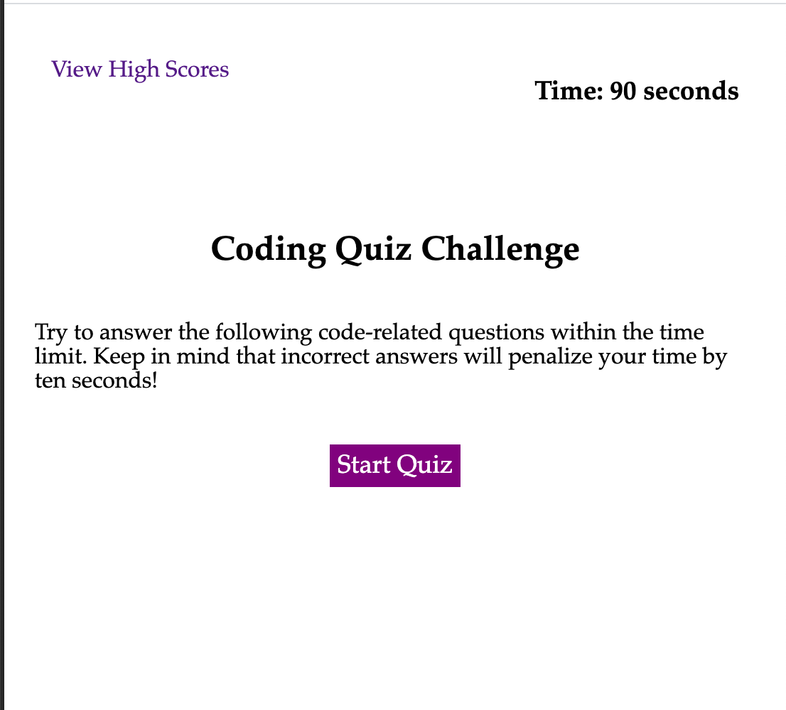

# code-quiz
Quick Online Quiz to Test Your Coding Knowledge - Good Luck!

## description
This is a quiz for coders to test their own knowledge, and compare with their peers.  Ten questions will challenge you with a time limit of one minute and ninety seconds. You are awarded one point for every question you answer correctly, for a total of ten points.  There is no score deduction if you answer incorrectly, but there is a time penalty of ten seconds. 

At the end, you can view your score in comparison with other coders' high scores. Enjoy!

## the process
This project challenged me to use my new Javascript skills. I learned how to implement a countdown timer, using the setInterval method to write a function that counts down time every second (or every 1000 milliseconds, since that's the unit in Javascript).  I got practice using the "click" event listener as well.  I also used setStorage and getStorage to save the user's score, and retrieve other scores get in local storage.

This project definitely challenged me. It was hard to figure out how to target the right answer to get a reaction, because the answers were created in the DOM - so it wasn't as simple as targeting HTML.  The most challenging part of Javascript for me is keeping track of the variables and elements that I create in the script, and how to organize my code.  I'm not sure if other coders have advice or go-to ways on organizing code and keeping track of their variables, elements, and functions.  If so, I'm all ears!

Preview of the quiz: 

Take the quiz here: 
https://suzannaakins.github.io/code-quiz/